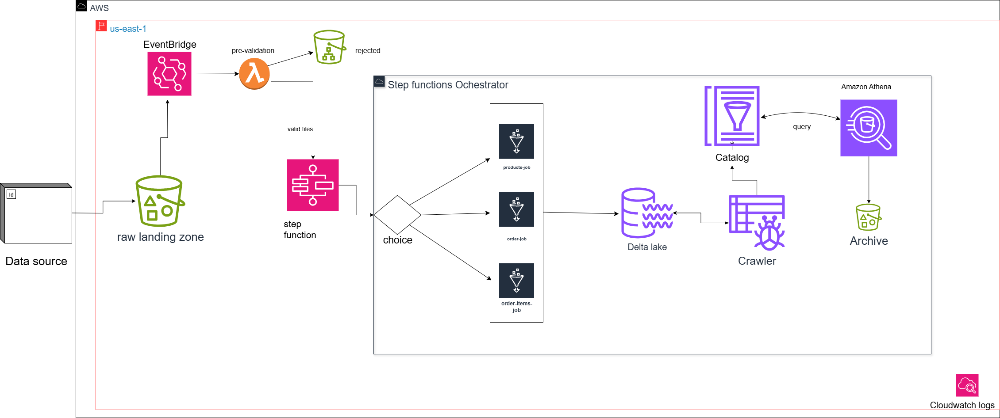

# E-Commerce Event-Driven Lakehouse on AWS

## 1. Project Overview

This project establishes a production-grade, event-driven data lakehouse on Amazon Web Services (AWS) to manage e-commerce transactional data. The primary objective is to create a scalable, automated pipeline that ensures data reliability, freshness, and accessibility for analytics. The system ingests raw transactional data in CSV (products) and XLSX (orders, order items) formats from Amazon S3, validates the schema, processes it into a query-optimized Delta Lake format, and exposes it to analysts via Amazon Athena. The pipeline is orchestrated by AWS Step Functions, with a new Lambda function for pre-validation, and follows Infrastructure-as-Code (IaC) principles via a CI/CD pipeline.

### Key Goals

- **Data Reliability**: Enforce schema validation, deduplication, and quality checks to ensure trustworthy data.
- **Data Freshness**: Use an event-driven architecture to process data upon arrival, minimizing latency.
- **Accessibility**: Enable analysts to query data using standard SQL via Athena.
- **Automation**: Fully automate ingestion, validation, processing, and archival.
- **Scalability**: Leverage serverless AWS services to handle varying data volumes.
- **Maintainability**: Use CI/CD to ensure consistent deployments and version control.

## 2. Architecture

The architecture is event-driven, triggered by file uploads to S3, with a new Lambda function performing schema validation before processing. This ensures only valid files enter the main pipeline, enhancing reliability.

### 2.1. High-Level Data Flow



**Detailed Workflow Explanation**:

1. **S3 File Upload**: Raw files (e.g., `orders-apr_2025.xlsx`) are uploaded to the `raw/` prefix, organized by data type (`raw/orders/`, `raw/products/`, `raw/order-items/`).
2. **EventBridge Trigger**: Amazon EventBridge detects the `Object Created` event and triggers the pre-validation Lambda function, passing the bucket name and file key.
3. **Lambda Pre-Validation**:
   - Inspects the S3 key to determine the file type (products, orders, or order items).
   - Reads the file header using `boto3` to check column names against predefined schemas:
     - **Products Schema**: `['product_id', 'department_id', 'department', 'product_name']`
     - **Orders Schema**: `['order_num', 'order_id', 'user_id', 'order_timestamp', 'total_amount', 'date']`
     - **Order Items Schema**: `['id', 'order_id', 'user_id', 'days_since_prior_order', 'product_id', ...]`
   - If valid, triggers the `Dynamic-ETL-Dispatcher` Step Function with the original event payload.
   - If invalid, moves the file to `rejected/invalid_schema/`, deletes it from `raw/`, logs the error to CloudWatch, and stops processing.
4. **Step Functions Dispatcher**: Routes valid files to the appropriate AWS Glue job based on the file key.
5. **Glue ETL Processing**: The Glue job uses PySpark to clean, validate, deduplicate, and transform data into Delta Lake format in the `processed/` prefix.
6. **Archival and Cleanup**: On success, the original file is moved to `archived/` and deleted from `raw/`.
7. **Glue Crawler Update**: Updates the AWS Glue Data Catalog to reflect new or updated Delta tables.
8. **Athena Querying**: Analysts query the processed data via Amazon Athena using SQL.

### 2.2. Component Breakdown

- **Amazon S3**: The data lake foundation, organized into prefixes:
  - `raw/`: Landing zone for incoming files (`products/`, `orders/`, `order-items/`).
  - `processed/`: Stores Delta Lake tables.
  - `archived/`: Retains processed files.
  - `rejected/invalid_schema/`: Stores files failing schema validation.
  - `scripts/`: Stores PySpark and Lambda scripts.
  - `athena-query-results/`: Stores Athena query outputs.
- **Amazon EventBridge**: Captures S3 `Object Created` events and triggers the pre-validation Lambda function.
- **AWS Lambda (Pre-Validation)**: Validates file schemas efficiently by reading headers, ensuring only valid files enter the pipeline.
- **AWS Step Functions**: Orchestrates the workflow for valid files, routing to Glue jobs and handling errors.
- **AWS Glue & PySpark**: Serverless Spark environment for ETL processing (cleaning, validation, transformation).
- **Delta Lake**: Provides ACID transactions, schema enforcement, and time-travel for data in `processed/`.
- **AWS Glue Data Catalog**: Metadata repository for table definitions, updated by the Glue Crawler.
- **Amazon Athena**: Serverless SQL engine for querying Delta tables.

## 3. Technology Stack & Rationale

| Service                | Rationale                                                                                                       |
| ---------------------- | --------------------------------------------------------------------------------------------------------------- |
| **Amazon S3**          | Scalable, durable, cost-effective storage with prefix-based organization for data zoning.                       |
| **AWS Lambda**         | Lightweight, serverless compute for schema validation, minimizing cost and latency before heavy ETL processing. |
| **AWS Glue**           | Serverless Spark environment with native S3 and Delta Lake integration for scalable ETL.                        |
| **Delta Lake**         | Enables ACID transactions, schema enforcement, and upserts, ensuring data reliability in the lakehouse.         |
| **AWS Step Functions** | Provides robust, serverless workflow orchestration with error handling and branching logic.                     |
| **Amazon EventBridge** | Decouples S3 events from processing, ensuring reliable triggering of Lambda and Step Functions.                 |
| **Amazon Athena**      | Simplifies analytics with serverless SQL querying on Delta tables.                                              |
| **GitHub Actions**     | Automates CI/CD with quality gates for code and infrastructure consistency.                                     |

## 4. Setup and Deployment

### 4.1. Prerequisites

- AWS Account
- GitHub Account and repository
- AWS CLI installed and configured locally

### 4.2. AWS Resource Setup (One-Time)

1. **Create S3 Bucket**:

   - **Name**: `lab5-ecommerce-lakehouse` (globally unique).
   - **Folders**: Create prefixes: `raw/`, `processed/`, `archived/`, `rejected/invalid_schema/`, `scripts/`, `athena-query-results/`.
   - **Sub-folders**: Under `raw/`, create `products/`, `orders/`, `order-items/`.
   - **EventBridge Integration**: In the bucket’s **Properties** tab, enable **Amazon EventBridge**.

2. **Create AWS Lambda Function**:

   - **Name**: `ecommerce-pre-validation`
   - **Runtime**: Python 3.9 or later.
   - **Role**: Create `Lab5-Lambda-Role` with permissions:
     ```json
     {
       "Version": "2012-10-17",
       "Statement": [
         {
           "Effect": "Allow",
           "Action": [
             "s3:GetObject",
             "s3:PutObject",
             "s3:DeleteObject",
             "s3:ListBucket"
           ],
           "Resource": [
             "arn:aws:s3:::lab5-ecommerce-lakehouse",
             "arn:aws:s3:::lab5-ecommerce-lakehouse/*"
           ]
         },
         {
           "Effect": "Allow",
           "Action": "states:StartExecution",
           "Resource": "arn:aws:states:*:YOUR_ACCOUNT_ID:stateMachine:Dynamic-ETL-Dispatcher"
         },
         {
           "Effect": "Allow",
           "Action": [
             "logs:CreateLogGroup",
             "logs:CreateLogStream",
             "logs:PutLogEvents"
           ],
           "Resource": "*"
         }
       ]
     }
     ```
     _(Replace `YOUR_ACCOUNT_ID` with your AWS account ID)_.
   - **Code**: Deploy a Python script (via CI/CD to `scripts/`) that:
     - Reads the S3 event payload.
     - Determines file type from the key.
     - Validates the header against expected schemas using `boto3` and `pandas`/`openpyxl` for CSV/XLSX.
     - Triggers Step Functions for valid files or moves invalid files to `rejected/invalid_schema/` and logs errors.
   - **Dependencies**: Include `pandas` and `openpyxl` in a Lambda layer or package.
   - **Trigger**: Configure EventBridge to invoke this Lambda for S3 `Object Created` events.

3. **Create Glue Jobs**:

   - **Jobs**: `process-products-job`, `process-orders-job`, `process-order-items-job`.
   - **Script Location**: Point to scripts in `s3://lab5-ecommerce-lakehouse/scripts/`.
   - **Glue Version**: 4.0 (for Delta Lake support).
   - **IAM Role**: `Lab5-Glue-Role`.
   - **Additional Python Modules**: For `orders` and `order-items` jobs, add `--additional-python-modules` with `openpyxl==3.1.2`.
   - **Parameters**: Leave `--S3_INPUT_PATH` blank for dynamic input.

4. **Create Glue Crawler**:

   - **Name**: `ecommerce-lakehouse-crawler`.
   - **Data Source**: `s3://lab5-ecommerce-lakehouse/processed/`.
   - **Database**: Create `ecommerce_db`.
   - **Role**: Use `Lab5-Glue-Role` or a dedicated crawler role.

5. **Create SNS Topics**:

   - **Topics**: `ecommerce-pipeline-failures`, `ecommerce-pipeline-success`.
   - **Subscriptions**: Add and confirm email subscriptions.

6. **Create IAM Roles**:
   - **Glue Role (`Lab5-Glue-Role`)**:
     - Attach `AWSGlueServiceRole`.
     - Add custom S3 policy:
       ```json
       {
         "Version": "2012-10-17",
         "Statement": [
           {
             "Effect": "Allow",
             "Action": [
               "s3:GetObject",
               "s3:PutObject",
               "s3:DeleteObject",
               "s3:ListBucket"
             ],
             "Resource": [
               "arn:aws:s3:::lab5-ecommerce-lakehouse",
               "arn:aws:s3:::lab5-ecommerce-lakehouse/*"
             ]
           }
         ]
       }
       ```
   - **Step Functions Role (`Lab5-AWSStepFunctionsLakehouseRole`)**:
     - Trust relationship for `states.amazonaws.com`.
     - Custom policy:
       ```json
       {
         "Version": "2012-10-17",
         "Statement": [
           {
             "Effect": "Allow",
             "Action": ["glue:StartJobRun", "glue:GetJobRun"],
             "Resource": "*"
           },
           {
             "Effect": "Allow",
             "Action": ["s3:*"],
             "Resource": [
               "arn:aws:s3:::lab5-ecommerce-lakehouse",
               "arn:aws:s3:::lab5-ecommerce-lakehouse/*"
             ]
           },
           {
             "Effect": "Allow",
             "Action": ["sns:Publish"],
             "Resource": [
               "arn:aws:sns:*:YOUR_ACCOUNT_ID:ecommerce-pipeline-failures",
               "arn:aws:sns:*:YOUR_ACCOUNT_ID:ecommerce-pipeline-success"
             ]
           },
           {
             "Effect": "Allow",
             "Action": [
               "glue:StartCrawler",
               "athena:StartQueryExecution",
               "athena:GetQueryExecution"
             ],
             "Resource": "*"
           }
         ]
       }
       ```

### 4.3. CI/CD Setup (GitHub Actions & OIDC)

1. **Create OIDC Provider in AWS**:

   - IAM > Identity providers > Add provider.
   - Provider URL: `https://token.actions.githubusercontent.com`.
   - Audience: `sts.amazonaws.com`.

2. **Create IAM Role for GitHub Actions (`GitHubActionsDeployerRole`)**:

   - Trusted entity: Web identity, select GitHub OIDC provider.
   - Scope to repository (e.g., `YourGitHubUser/aws-ecommerce-lakehouse`).
   - Permissions:
     ```json
     {
       "Version": "2012-10-17",
       "Statement": [
         {
           "Sid": "AllowS3ScriptsSync",
           "Effect": "Allow",
           "Action": ["s3:PutObject", "s3:DeleteObject"],
           "Resource": "arn:aws:s3:::lab5-ecommerce-lakehouse/scripts/*"
         },
         {
           "Sid": "AllowS3ListForSync",
           "Effect": "Allow",
           "Action": "s3:ListBucket",
           "Resource": "arn:aws:s3:::lab5-ecommerce-lakehouse"
         },
         {
           "Sid": "AllowStepFunctionUpdate",
           "Effect": "Allow",
           "Action": "states:UpdateStateMachine",
           "Resource": "arn:YOUR_STATE_MACHINE_ARN"
         },
         {
           "Sid": "AllowLambdaUpdate",
           "Effect": "Allow",
           "Action": [
             "lambda:UpdateFunctionCode",
             "lambda:UpdateFunctionConfiguration"
           ],
           "Resource": "arn:aws:lambda:*:YOUR_ACCOUNT_ID:function:ecommerce-pre-validation"
         }
       ]
     }
     ```

3. **Configure GitHub Secrets & Variables**:

   - In GitHub repo **Settings > Secrets and variables > Actions**:
     - Secret: `AWS_ROLE_ARN` (ARN of `GitHubActionsDeployerRole`).
     - Variable: `STATE_MACHINE_ARN` (ARN of `Dynamic-ETL-Dispatcher`).
     - Variable: `LAMBDA_FUNCTION_ARN` (ARN of `ecommerce-pre-validation`).

4. **Update GitHub Actions Workflow**:
   - Modify `deploy.yml` to deploy the Lambda function code to S3 and update the function via `lambda:UpdateFunctionCode`.

## 5. Usage

### 5.1. Automated Triggering

Upload files to S3 `raw/` sub-folders:

- `raw/products/` for product CSVs.
- `raw/orders/` for orders XLSX.
- `raw/order-items/` for order items XLSX.

The upload triggers EventBridge, which invokes the `ecommerce-pre-validation` Lambda. Valid files proceed to Step Functions; invalid files are moved to `rejected/invalid_schema/` and logged.

### 5.2. Manual Testing

1. Navigate to the `ecommerce-pre-validation` Lambda in the AWS console.
2. Create a test event with an S3 event payload, e.g.:
   ```json
   {
     "Records": [
       {
         "s3": {
           "bucket": {
             "name": "lab5-ecommerce-lakehouse"
           },
           "object": {
             "key": "raw/orders/orders-apr_2025.xlsx"
           }
         }
       }
     ]
   }
   ```
3. Test the Lambda function and verify:
   - Valid files trigger the Step Function.
   - Invalid files are moved to `rejected/invalid_schema/` with CloudWatch logs.
4. Alternatively, test the Step Function directly with:
   ```json
   {
     "detail": {
       "bucket": {
         "name": "lab5-ecommerce-lakehouse"
       },
       "object": {
         "key": "raw/orders/orders-apr_2025.xlsx"
       }
     }
   }
   ```

## 6. Troubleshooting

- **EventBridge Not Triggering Lambda**:

  - Verify EventBridge is enabled in S3 bucket properties.
  - Check the EventBridge rule’s **Monitoring** tab for `Invocations`.
  - Ensure the rule targets the `ecommerce-pre-validation` Lambda.

- **Lambda Fails with Access Denied**:

  - Verify `Lab5-Lambda-Role` has `s3:GetObject`, `s3:PutObject`, `s3:DeleteObject`, `states:StartExecution`, and CloudWatch logs permissions.

- **Lambda Fails to Read File Header**:

  - Ensure `pandas` and `openpyxl` are included in the Lambda layer or package.
  - Check if the file is a valid CSV/XLSX and accessible in S3.

- **Invalid Schema Not Logged**:

  - Check CloudWatch Logs for the `ecommerce-pre-validation` function.
  - Ensure the Lambda role has `logs:PutLogEvents` permission.

- **Glue Job `NoSuchKey` Error**:

  - Verify the file exists in `raw/` and was not moved to `rejected/` by the Lambda.

- **Glue Job `BadZipFile` Error**:

  - Re-save and re-upload the XLSX file to ensure it’s not corrupted.

- **Access Denied Errors**:
  - Review IAM policies for `Lab5-Glue-Role`, `Lab5-AWSStepFunctionsLakehouseRole`, and `Lab5-Lambda-Role`.

## 7. Future Improvements

- **Synchronous Crawler**: Replace async `Run_Glue_Crawler` with a polling loop using `Wait` and `GetCrawler` states.
- **Athena Validation**: Add post-crawler data quality checks via Athena (e.g., record counts, null checks).
- **CI/CD Testing**: Add a `pytest` job in `deploy.yml` to test PySpark and Lambda code.
- **Infrastructure as Code**: Use Terraform/CloudFormation to automate AWS resource setup.
- **Enhanced Lambda Validation**: Extend the Lambda to check data types or sample rows for stricter validation.
- **Monitoring**: Integrate CloudWatch metrics and alarms for Lambda, Glue, and Step Functions.

## 8. Additional Notes

- **Security**: Follow least privilege for IAM roles. Rotate GitHub secrets regularly.
- **Cost**: Monitor Lambda invocations, Glue job runtime, and Athena query costs using AWS Cost Explorer.
- **Scalability**: Lambda and Glue scale automatically, but monitor performance for large files and adjust Lambda memory if needed.

This README provides a comprehensive guide for setting up and maintaining the lakehouse, including the new pre-validation Lambda function.
